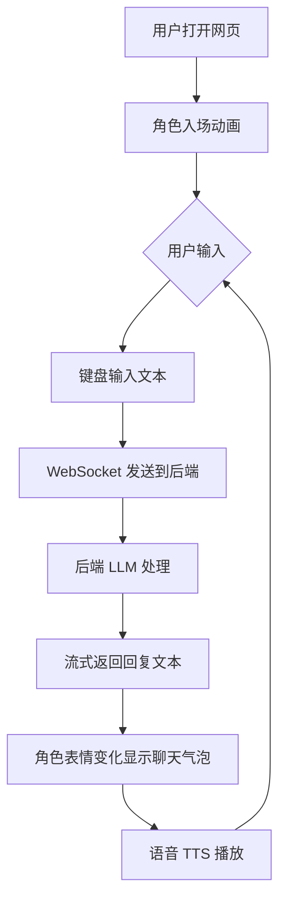

## 1. 产品概述

为"小爱"语音助手创建一个 Web 前端界面，核心是一个类似蔚来 NOMI 的可爱 2D 动画角色，能与用户进行实时对话交互。

- 目标用户：已部署"小爱"后端桌面语音助手的用户，希望通过浏览器获得更丰富的交互体验
- 价值：将纯语音交互升级为可视化交互，让 AI 助手拥有生动的形象和情感表达

## 2. 核心功能

### 2.1 用户角色

| 角色 | 方式 | 核心权限 |
|------|------|----------|
| 普通用户 | 直接打开网页 | 与 AI 角色对话、查看聊天记录、配置连接 |

### 2.2 功能模块

1. **对话页面**：AI 角色形象展示、聊天界面、文本输入
2. **设置面板**：WebSocket 连接配置

### 2.3 页面详情

| 页面名称 | 模块名称 | 功能描述 |
|---------|---------|----------|
| 对话页 | AI 角色 | 2D 动画角色，带表情变化、嘴型同步、待机 idle 动画 |
| 对话页 | 聊天气泡 | 显示对话历史，支持文本消息 |
| 对话页 | 输入区 | 文本输入框 + 发送按钮 |
| 对话页 | 设置按钮 | 打开配置面板的入口 |
| 设置面板 | 连接配置 | WebSocket 地址和端口配置 |

## 3. 核心流程

用户打开网页 → 角色出现并播放入场动画 → 用户输入文本 → 消息通过 WebSocket 发送到后端 → 后端 LLM 处理 → 流式返回回复 → 角色嘴型同步播放回复文本 → 角色表情随内容变化 → 继续对话

## 4. 用户界面设计

### 4.1 设计风格

- **整体风格**：未来感 + 温馨治愈，深色主题，类似智能座舱 HUD 风格
- **主色调**：深蓝黑色背景 (#0a0e1a)，霓虹青 (#00d4ff) 作为主色，暖橙 (#ff6b35) 作为强调色
- **角色风格**：圆润可爱的 2D 矢量角色，圆圆的大眼睛，简洁 body
- **字体**：使用圆润无衬线字体，整体简洁现代
- **布局**：角色居中偏上，对话区域在下方，沉浸式全屏设计

### 4.2 页面设计概览

| 页面名称 | 模块名称 | 界面元素 |
|---------|---------|----------|
| 对话页 | AI 角色中心 | 2D 动画角色 CSS/SVG 实现，包含眼睛、嘴巴、身体动画、表情切换、背景发光效果 |
| 对话页 | 聊天气泡区域 | 半透明滚动列表，用户消息右对齐，AI 消息左对齐，打字机效果 |
| 对话页 | 底部输入栏 | 圆角输入框，发送按钮，深色半透明毛玻璃效果 |
| 设置面板 | 连接配置 | WebSocket 地址输入框、端口输入框、保存按钮 |

### 4.3 响应式设计

- 桌面优先，适配 1920x1080 及以上分辨率
- 移动端适配：角色缩小，输入栏置底

## 5. 动画与交互规范

### 5.1 角色动画状态

| 状态 | 触发条件 | 动画描述 |
|------|----------|----------|
| 待机 | 无交互 | 轻微上下浮动，眼睛缓慢眨动，每 3-5 秒一次 |
| 聆听 | 用户正在输入 | 头部微微倾斜，眼睛专注看向用户侧 |
| 思考 | 消息已发送，等待回复 | 眼睛向上看，头部轻微摇晃 |
| 说话 | AI 正在回复 | 嘴型同步开合，眼睛弯弯，头部轻微晃动 |
| 开心 | 积极情绪 | 眼睛变成 ^_^，身体跳跃，背景光晕闪烁 |

### 5.2 页面过渡动画

- 页面载入：角色从底部浮入 + 光晕展开
- 消息出现：淡入 + 轻微上滑

## 6. 技术约束

- 使用 Vite + React + TypeScript
- 使用 Vite + React + TypeScript
- 动画使用 CSS keyframes + Framer Motion
- 使用原生 WebSocket API 与后端通信