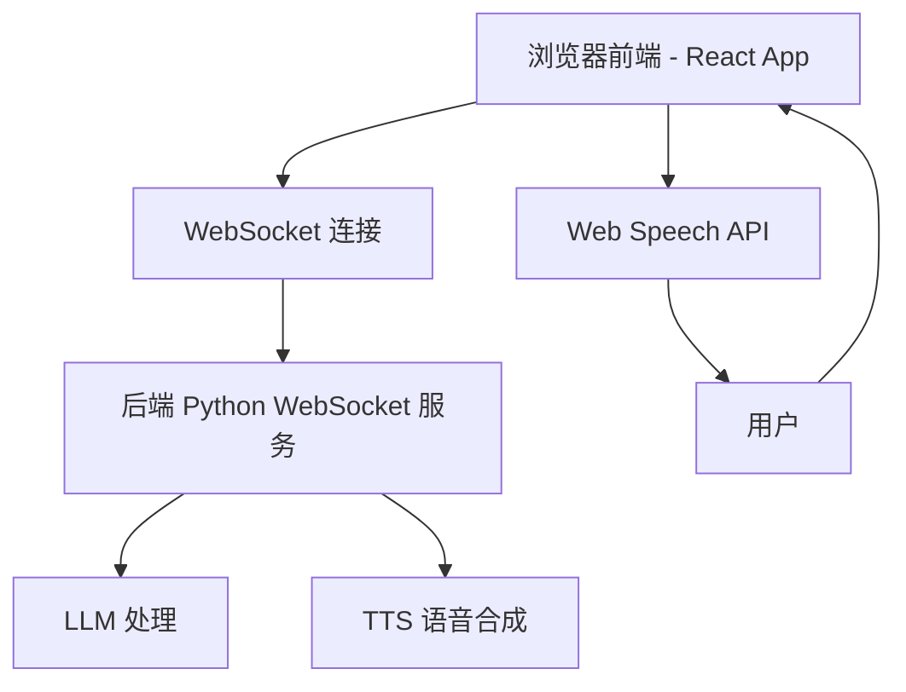

## 1. 架构设计



## 2. 技术选型

- **前端框架**：React 18 + TypeScript
- **构建工具**：Vite
- **动画库**：CSS keyframes + Framer Motion
- **CSS 方案**：Tailwind CSS
- **通信方式**：原生 WebSocket API
- **语音输入**：Web Speech API (浏览器语音识别)
- **包管理**：npm

## 3. 组件结构

```
src/
├── App.tsx                    # 主应用组件
├── main.tsx                   # 入口文件
├── index.css                  # 全局样式
├── components/
│   ├── AiCharacter/           # AI 角色组件
│   │   ├── AiCharacter.tsx    # 角色主组件
│   │   ├── CharacterBody.tsx  # 身体 SVG 动画
│   │   ├── CharacterFace.tsx  # 面部表情动画
│   │   └── expressions.ts    # 表情状态定义
│   ├── Chat/
│   │   ├── ChatPanel.tsx      # 聊天面板
│   │   ├── MessageBubble.tsx  # 消息气泡
│   │   └── TypingIndicator.tsx # 打字指示器
│   ├── Input/
│   │   ├── InputBar.tsx       # 输入栏
│   │   ├── InputBar.tsx       # 输入栏
│   │   └── VoiceButton.tsx    # 语音按钮
│   └── Settings/
│       └── SettingsPanel.tsx  # 设置面板
├── hooks/
│   ├── useWebSocket.ts       # WebSocket 连接 Hook
│   ├── useSpeechRecognition.ts # 语音识别 Hook
│   └── useCharacterState.ts  # 角色状态管理 Hook
├── types/
│   └── index.ts              # 类型定义
└── utils/
    └── websocket.ts          # WebSocket 工具函数
```

## 4. WebSocket API 定义

### 4.1 客户端 → 服务端

```typescript
// 发送消息
interface ClientMessage {
  type: "message";
  content: string;
}

// 连接请求
interface ClientConnect {
  type: "connect";
  client_id?: string;
}
```

### 4.2 服务端 → 客户端

```typescript
// 文本回复（流式）
interface ServerMessage {
  type: "message";
  content: string;
  is_final: boolean;  // 是否是最后一条
  emotion?: "neutral" | "happy" | "thinking" | "sad";
}

// 错误信息
interface ServerError {
  type: "error";
  message: string;
}
```

## 5. 数据模型

```typescript
// 消息类型
interface Message {
  id: string;
  role: "user" | "assistant";
  content: string;
  timestamp: number;
  emotion?: EmotionType;
}

// 角色状态
type EmotionType = "idle" | "listening" | "thinking" | "speaking" | "happy";

// 角色表情状态
interface CharacterState {
  emotion: EmotionType;
  isMouthOpen: boolean;
  blinkTimer: number;
}
```

## 6. 连接配置

默认配置：
- WebSocket URL: ws://localhost:8765
- 支持用户在设置面板中自定义地址